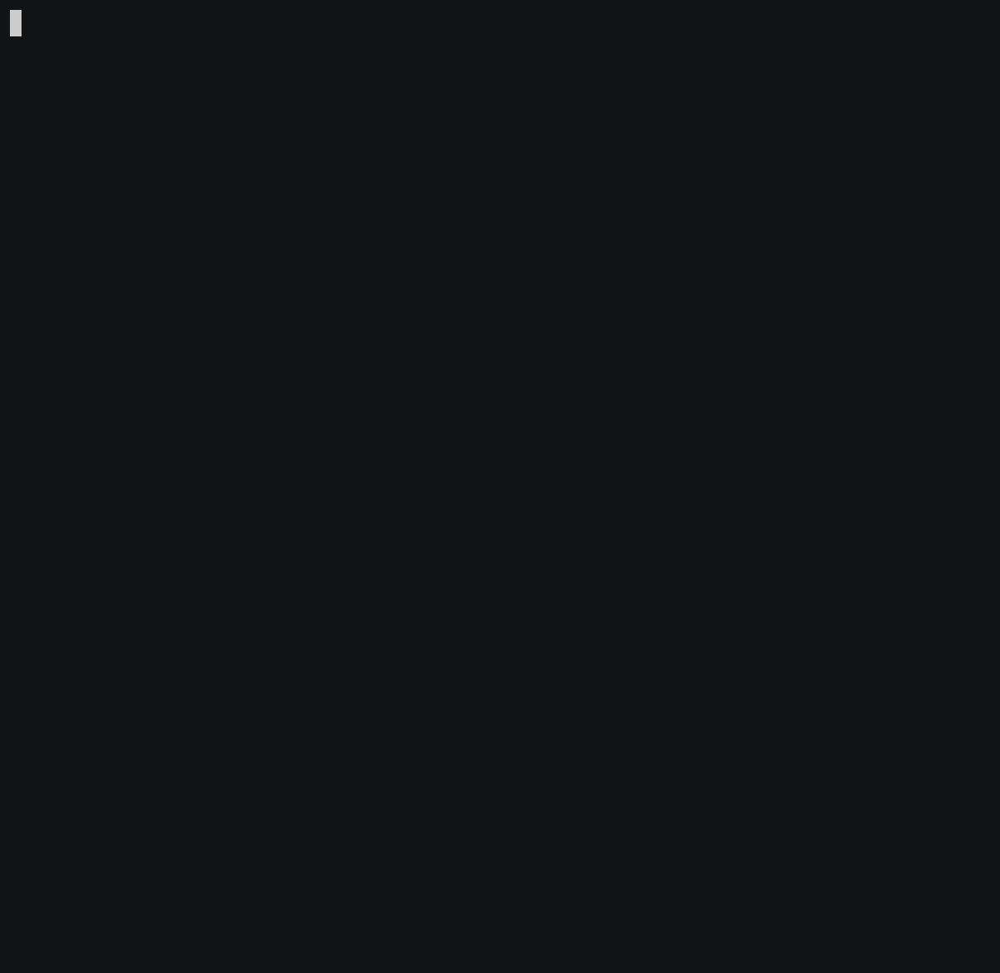

# TerminalCalendar

[](https://github.com/DimitarVanguelov/TerminalCalendar.jl/actions/workflows/CI.yml?query=branch%3Amain)
[](https://www.repostatus.org/#wip)


A simple package to view dates in monthly calendar format from the comfort of your REPL, 
built on top of [PrettyTables.jl](https://github.com/ronisbr/PrettyTables.jl).

Currently, only the English language Gregorian calendar is supported.


## Installation

This package isn't registered yet, so just install by pointing to this repo:

```julia
] add https://github.com/DimitarVanguelov/TerminalCalendar.jl.git
```


## Usage




There is only a single exported function `calendar`. In its most basic form, 
it takes zero arguments and prints the current month to the screen:

```julia
julia> calendar()

              November 2021
┌─────┬─────┬─────┬─────┬─────┬─────┬─────┐
│ Mon │ Tue │ Wed │ Thu │ Fri │ Sat │ Sun │
├─────┼─────┼─────┼─────┼─────┼─────┼─────┤
│   1 │   2 │   3 │   4 │   5 │   6 │   7 │
│   8 │   9 │  10 │  11 │  12 │  13 │  14 │
│  15 │  16 │  17 │  18 │  19 │  20 │  21 │
│  22 │  23 │  24 │  25 │  26 │  27 │  28 │
│  29 │  30 │     │     │     │     │     │
└─────┴─────┴─────┴─────┴─────┴─────┴─────┘
```

or it can take two `Int` values for year and month:

```julia
julia> calendar(2021, 12)

              December 2021
┌─────┬─────┬─────┬─────┬─────┬─────┬─────┐
│ Mon │ Tue │ Wed │ Thu │ Fri │ Sat │ Sun │
├─────┼─────┼─────┼─────┼─────┼─────┼─────┤
│     │     │   1 │   2 │   3 │   4 │   5 │
│   6 │   7 │   8 │   9 │  10 │  11 │  12 │
│  13 │  14 │  15 │  16 │  17 │  18 │  19 │
│  20 │  21 │  22 │  23 │  24 │  25 │  26 │
│  27 │  28 │  29 │  30 │  31 │     │     │
└─────┴─────┴─────┴─────┴─────┴─────┴─────┘
```

You can also input a `Date` object (after importing `Dates`):

```julia
julia> calendar(Date(2021, 12))

              December 2021
┌─────┬─────┬─────┬─────┬─────┬─────┬─────┐
│ Mon │ Tue │ Wed │ Thu │ Fri │ Sat │ Sun │
├─────┼─────┼─────┼─────┼─────┼─────┼─────┤
│     │     │   1 │   2 │   3 │   4 │   5 │
│   6 │   7 │   8 │   9 │  10 │  11 │  12 │
│  13 │  14 │  15 │  16 │  17 │  18 │  19 │
│  20 │  21 │  22 │  23 │  24 │  25 │  26 │
│  27 │  28 │  29 │  30 │  31 │     │     │
└─────┴─────┴─────┴─────┴─────┴─────┴─────┘
```

The [text table formats](https://ronisbr.github.io/PrettyTables.jl/stable/man/text_backend/#Text-table-formats) 
provided by PrettyTables.jl are re-exported so you could pass those as optional arguments to jazz up the how the 
calendar looks:

```julia
julia> calendar(2021, 12; tf=tf_compact)

              December 2021
 ----- ----- ----- ----- ----- ----- -----
  Mon   Tue   Wed   Thu   Fri   Sat   Sun
 ----- ----- ----- ----- ----- ----- -----
                1     2     3     4     5
    6     7     8     9    10    11    12
   13    14    15    16    17    18    19
   20    21    22    23    24    25    26
   27    28    29    30    31
 ----- ----- ----- ----- ----- ----- -----

```

Currently, only the text back-end formats are re-exported.


### More options
<details>
 <summaryClick me! ></summary>
<p>

You can pass in ranges:

```julia
julia> calendar(2021, 10:12)

               October 2021
┌─────┬─────┬─────┬─────┬─────┬─────┬─────┐
│ Mon │ Tue │ Wed │ Thu │ Fri │ Sat │ Sun │
├─────┼─────┼─────┼─────┼─────┼─────┼─────┤
│     │     │     │     │   1 │   2 │   3 │
│   4 │   5 │   6 │   7 │   8 │   9 │  10 │
│  11 │  12 │  13 │  14 │  15 │  16 │  17 │
│  18 │  19 │  20 │  21 │  22 │  23 │  24 │
│  25 │  26 │  27 │  28 │  29 │  30 │  31 │
└─────┴─────┴─────┴─────┴─────┴─────┴─────┘

              November 2021
┌─────┬─────┬─────┬─────┬─────┬─────┬─────┐
│ Mon │ Tue │ Wed │ Thu │ Fri │ Sat │ Sun │
├─────┼─────┼─────┼─────┼─────┼─────┼─────┤
│   1 │   2 │   3 │   4 │   5 │   6 │   7 │
│   8 │   9 │  10 │  11 │  12 │  13 │  14 │
│  15 │  16 │  17 │  18 │  19 │  20 │  21 │
│  22 │  23 │  24 │  25 │  26 │  27 │  28 │
│  29 │  30 │     │     │     │     │     │
└─────┴─────┴─────┴─────┴─────┴─────┴─────┘

              December 2021
┌─────┬─────┬─────┬─────┬─────┬─────┬─────┐
│ Mon │ Tue │ Wed │ Thu │ Fri │ Sat │ Sun │
├─────┼─────┼─────┼─────┼─────┼─────┼─────┤
│     │     │   1 │   2 │   3 │   4 │   5 │
│   6 │   7 │   8 │   9 │  10 │  11 │  12 │
│  13 │  14 │  15 │  16 │  17 │  18 │  19 │
│  20 │  21 │  22 │  23 │  24 │  25 │  26 │
│  27 │  28 │  29 │  30 │  31 │     │     │
└─────┴─────┴─────┴─────┴─────┴─────┴─────┘
```

You can also pass in vectors of dates:

```julia
julia> febs = lastdayofmonth.(Date(2010, 2):Year(1):Date(2020, 2));
julia> leap_febs = filter(x -> day(x) == 29, febs)
3-element Vector{Date}:
 2012-02-29
 2016-02-29
 2020-02-29

julia> calendar(leap_febs)

              February 2012
┌─────┬─────┬─────┬─────┬─────┬─────┬─────┐
│ Mon │ Tue │ Wed │ Thu │ Fri │ Sat │ Sun │
├─────┼─────┼─────┼─────┼─────┼─────┼─────┤
│     │     │   1 │   2 │   3 │   4 │   5 │
│   6 │   7 │   8 │   9 │  10 │  11 │  12 │
│  13 │  14 │  15 │  16 │  17 │  18 │  19 │
│  20 │  21 │  22 │  23 │  24 │  25 │  26 │
│  27 │  28 │  29 │     │     │     │     │
└─────┴─────┴─────┴─────┴─────┴─────┴─────┘

              February 2016
┌─────┬─────┬─────┬─────┬─────┬─────┬─────┐
│ Mon │ Tue │ Wed │ Thu │ Fri │ Sat │ Sun │
├─────┼─────┼─────┼─────┼─────┼─────┼─────┤
│   1 │   2 │   3 │   4 │   5 │   6 │   7 │
│   8 │   9 │  10 │  11 │  12 │  13 │  14 │
│  15 │  16 │  17 │  18 │  19 │  20 │  21 │
│  22 │  23 │  24 │  25 │  26 │  27 │  28 │
│  29 │     │     │     │     │     │     │
└─────┴─────┴─────┴─────┴─────┴─────┴─────┘

              February 2020
┌─────┬─────┬─────┬─────┬─────┬─────┬─────┐
│ Mon │ Tue │ Wed │ Thu │ Fri │ Sat │ Sun │
├─────┼─────┼─────┼─────┼─────┼─────┼─────┤
│     │     │     │     │     │   1 │   2 │
│   3 │   4 │   5 │   6 │   7 │   8 │   9 │
│  10 │  11 │  12 │  13 │  14 │  15 │  16 │
│  17 │  18 │  19 │  20 │  21 │  22 │  23 │
│  24 │  25 │  26 │  27 │  28 │  29 │     │
└─────┴─────┴─────┴─────┴─────┴─────┴─────┘
```

You can get the calendar for a whole year simply by inputting a single `Int`:

```julia
julia> calendar(2021)

               January 2021
┌─────┬─────┬─────┬─────┬─────┬─────┬─────┐
│ Mon │ Tue │ Wed │ Thu │ Fri │ Sat │ Sun │
├─────┼─────┼─────┼─────┼─────┼─────┼─────┤
│     │     │     │     │   1 │   2 │   3 │
│   4 │   5 │   6 │   7 │   8 │   9 │  10 │
│  11 │  12 │  13 │  14 │  15 │  16 │  17 │
│  18 │  19 │  20 │  21 │  22 │  23 │  24 │
│  25 │  26 │  27 │  28 │  29 │  30 │  31 │
└─────┴─────┴─────┴─────┴─────┴─────┴─────┘

              February 2021
┌─────┬─────┬─────┬─────┬─────┬─────┬─────┐
│ Mon │ Tue │ Wed │ Thu │ Fri │ Sat │ Sun │
├─────┼─────┼─────┼─────┼─────┼─────┼─────┤
│   1 │   2 │   3 │   4 │   5 │   6 │   7 │
│   8 │   9 │  10 │  11 │  12 │  13 │  14 │
│  15 │  16 │  17 │  18 │  19 │  20 │  21 │
│  22 │  23 │  24 │  25 │  26 │  27 │  28 │
└─────┴─────┴─────┴─────┴─────┴─────┴─────┘

                March 2021
┌─────┬─────┬─────┬─────┬─────┬─────┬─────┐
│ Mon │ Tue │ Wed │ Thu │ Fri │ Sat │ Sun │
├─────┼─────┼─────┼─────┼─────┼─────┼─────┤
│   1 │   2 │   3 │   4 │   5 │   6 │   7 │
│   8 │   9 │  10 │  11 │  12 │  13 │  14 │
│  15 │  16 │  17 │  18 │  19 │  20 │  21 │
│  22 │  23 │  24 │  25 │  26 │  27 │  28 │
│  29 │  30 │  31 │     │     │     │     │
└─────┴─────┴─────┴─────┴─────┴─────┴─────┘

                April 2021
┌─────┬─────┬─────┬─────┬─────┬─────┬─────┐
│ Mon │ Tue │ Wed │ Thu │ Fri │ Sat │ Sun │
├─────┼─────┼─────┼─────┼─────┼─────┼─────┤
│     │     │     │   1 │   2 │   3 │   4 │
│   5 │   6 │   7 │   8 │   9 │  10 │  11 │
│  12 │  13 │  14 │  15 │  16 │  17 │  18 │
│  19 │  20 │  21 │  22 │  23 │  24 │  25 │
│  26 │  27 │  28 │  29 │  30 │     │     │
└─────┴─────┴─────┴─────┴─────┴─────┴─────┘

                 May 2021
┌─────┬─────┬─────┬─────┬─────┬─────┬─────┐
│ Mon │ Tue │ Wed │ Thu │ Fri │ Sat │ Sun │
├─────┼─────┼─────┼─────┼─────┼─────┼─────┤
│     │     │     │     │     │   1 │   2 │
│   3 │   4 │   5 │   6 │   7 │   8 │   9 │
│  10 │  11 │  12 │  13 │  14 │  15 │  16 │
│  17 │  18 │  19 │  20 │  21 │  22 │  23 │
│  24 │  25 │  26 │  27 │  28 │  29 │  30 │
│  31 │     │     │     │     │     │     │
└─────┴─────┴─────┴─────┴─────┴─────┴─────┘

                June 2021
┌─────┬─────┬─────┬─────┬─────┬─────┬─────┐
│ Mon │ Tue │ Wed │ Thu │ Fri │ Sat │ Sun │
├─────┼─────┼─────┼─────┼─────┼─────┼─────┤
│     │   1 │   2 │   3 │   4 │   5 │   6 │
│   7 │   8 │   9 │  10 │  11 │  12 │  13 │
│  14 │  15 │  16 │  17 │  18 │  19 │  20 │
│  21 │  22 │  23 │  24 │  25 │  26 │  27 │
│  28 │  29 │  30 │     │     │     │     │
└─────┴─────┴─────┴─────┴─────┴─────┴─────┘

                July 2021
┌─────┬─────┬─────┬─────┬─────┬─────┬─────┐
│ Mon │ Tue │ Wed │ Thu │ Fri │ Sat │ Sun │
├─────┼─────┼─────┼─────┼─────┼─────┼─────┤
│     │     │     │   1 │   2 │   3 │   4 │
│   5 │   6 │   7 │   8 │   9 │  10 │  11 │
│  12 │  13 │  14 │  15 │  16 │  17 │  18 │
│  19 │  20 │  21 │  22 │  23 │  24 │  25 │
│  26 │  27 │  28 │  29 │  30 │  31 │     │
└─────┴─────┴─────┴─────┴─────┴─────┴─────┘

               August 2021
┌─────┬─────┬─────┬─────┬─────┬─────┬─────┐
│ Mon │ Tue │ Wed │ Thu │ Fri │ Sat │ Sun │
├─────┼─────┼─────┼─────┼─────┼─────┼─────┤
│     │     │     │     │     │     │   1 │
│   2 │   3 │   4 │   5 │   6 │   7 │   8 │
│   9 │  10 │  11 │  12 │  13 │  14 │  15 │
│  16 │  17 │  18 │  19 │  20 │  21 │  22 │
│  23 │  24 │  25 │  26 │  27 │  28 │  29 │
│  30 │  31 │     │     │     │     │     │
└─────┴─────┴─────┴─────┴─────┴─────┴─────┘

              September 2021
┌─────┬─────┬─────┬─────┬─────┬─────┬─────┐
│ Mon │ Tue │ Wed │ Thu │ Fri │ Sat │ Sun │
├─────┼─────┼─────┼─────┼─────┼─────┼─────┤
│     │     │   1 │   2 │   3 │   4 │   5 │
│   6 │   7 │   8 │   9 │  10 │  11 │  12 │
│  13 │  14 │  15 │  16 │  17 │  18 │  19 │
│  20 │  21 │  22 │  23 │  24 │  25 │  26 │
│  27 │  28 │  29 │  30 │     │     │     │
└─────┴─────┴─────┴─────┴─────┴─────┴─────┘

               October 2021
┌─────┬─────┬─────┬─────┬─────┬─────┬─────┐
│ Mon │ Tue │ Wed │ Thu │ Fri │ Sat │ Sun │
├─────┼─────┼─────┼─────┼─────┼─────┼─────┤
│     │     │     │     │   1 │   2 │   3 │
│   4 │   5 │   6 │   7 │   8 │   9 │  10 │
│  11 │  12 │  13 │  14 │  15 │  16 │  17 │
│  18 │  19 │  20 │  21 │  22 │  23 │  24 │
│  25 │  26 │  27 │  28 │  29 │  30 │  31 │
└─────┴─────┴─────┴─────┴─────┴─────┴─────┘

              November 2021
┌─────┬─────┬─────┬─────┬─────┬─────┬─────┐
│ Mon │ Tue │ Wed │ Thu │ Fri │ Sat │ Sun │
├─────┼─────┼─────┼─────┼─────┼─────┼─────┤
│   1 │   2 │   3 │   4 │   5 │   6 │   7 │
│   8 │   9 │  10 │  11 │  12 │  13 │  14 │
│  15 │  16 │  17 │  18 │  19 │  20 │  21 │
│  22 │  23 │  24 │  25 │  26 │  27 │  28 │
│  29 │  30 │     │     │     │     │     │
└─────┴─────┴─────┴─────┴─────┴─────┴─────┘

              December 2021
┌─────┬─────┬─────┬─────┬─────┬─────┬─────┐
│ Mon │ Tue │ Wed │ Thu │ Fri │ Sat │ Sun │
├─────┼─────┼─────┼─────┼─────┼─────┼─────┤
│     │     │   1 │   2 │   3 │   4 │   5 │
│   6 │   7 │   8 │   9 │  10 │  11 │  12 │
│  13 │  14 │  15 │  16 │  17 │  18 │  19 │
│  20 │  21 │  22 │  23 │  24 │  25 │  26 │
│  27 │  28 │  29 │  30 │  31 │     │     │
└─────┴─────┴─────┴─────┴─────┴─────┴─────┘
```
Currently, displaying an entire year on one screen is not implemented, 
though that is a planned feature.


And there is more, just play around with it and see what works!

</p>
</details>
<br>


## Development

Much thanks to Ronan Arraes Jardim Chagas for his help!

This package is mostly just fun and learning. If you have ideas 
for improvement, please open an issue, submit a PR, or contact me 
on Slack.


### Planned Features

- [ ] date highlighting
- [ ] whole year calendar on one screen
- [ ] ability to save a calendar table as a string
